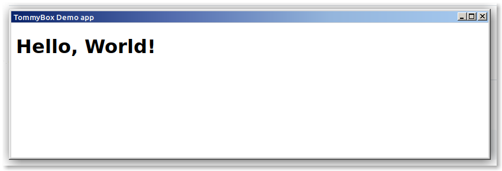

# 🍥 TommyBox Demo App



Simplest TommyBox app is just standard HTML/JavaScript etc.<br><br>
<h2>The easiest way to try TommyBox:</h2>

<ol>
	<li>Download the latest TommyBox jar: <a href="https://github.com/xnbox/tommybox/releases/download/v2.14.1/tb-2.14.1.jar">tb-2.14.1.jar</a></li>
	<li>Run demo app remotely:</li>
</ol>

```text
java -jar tb-2.14.1.jar --app https://github.com/xnbox/tommybox_demo/raw/main/RELEASE/app.zip
```

<h2>Embed demo app:</h2>

<ol>
	<li>Download the latest TommyBox jar: <a href="https://github.com/xnbox/tommybox/releases/download/v2.14.1/tb-2.14.1.jar">tb-2.14.1.jar</a></li>
	<li>Download the demo app <code>app.zip</code>: <a href="https://github.com/xnbox/tommybox_demo/raw/main/RELEASE/app.zip">https://github.com/xnbox/tommybox_demo/raw/main/RELEASE/app.zip</a></li>
	<li>Copy <code>app.zip</code> into the root directory of the <code>tb-2.14.1.jar</code> file</li>
	<li>Run embedded demo app:</li>
</ol>

```text
java -jar tb-2.14.1.jar
```

<h2>Get more:</h2>

<ul>
	<li>Explore the demo app <a href="https://github.com/xnbox/tommybox_demo/tree/main/app">sources</a><br></li>
	<li>Please visit <a href="https://github.com/xnbox/tommybox">TommyBox</a> home page for more options</li>
</ul>

